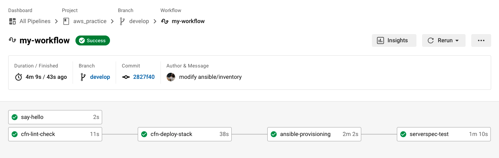

# CircleCI　Pipeline
* ワークフロー図
	

* CircleCIによる実行項目 （".circleci/config.yml"参照）
  1. 実行確認
    - 'Say hello'の実行
    - 'pwd','ls'の実行
  2. cfn-lintによるCloudFormationテンプレートのチェック
    - cfn-lintのインストール
    - cfn-lintを実行
  3. CloudFormationテンプレートからのスタック作成・変更
    - AWS CLIで"cloudformation deploy"を実行（orbsを利用）
  4. Ansibleによる環境構築
    - SSHキーの登録
    - Ansibleのインストール
    - 初回SSH接続時の確認をスキップする設定（"~/.ansible.cfg"に記載）
    - Ansibleの実行
  5. Serverspecによるテスト
    - Serverspecのインストール
    - Serverspecの実行
