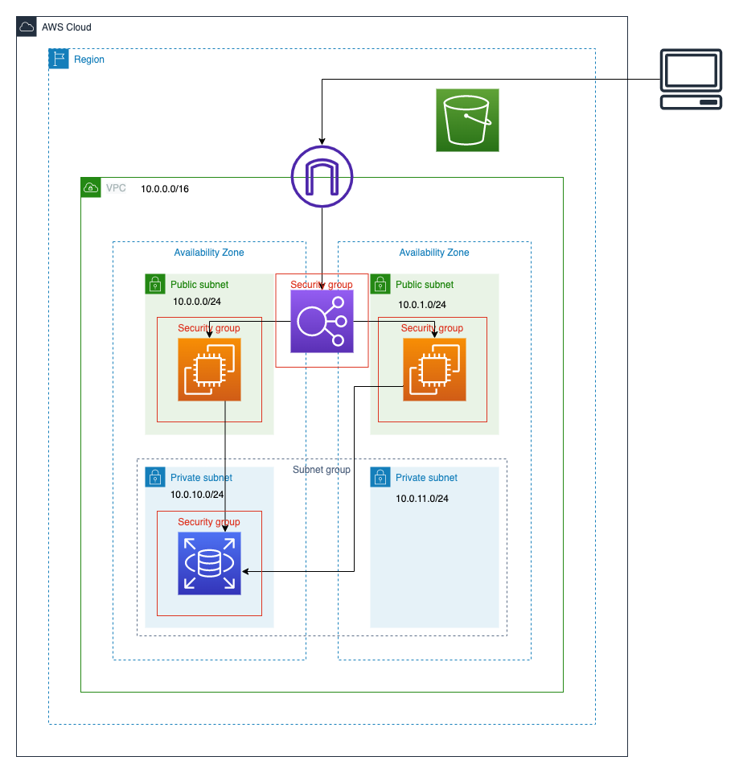

# CloudFormation Templates
* 構成図
	

* 01_vpc.yml
	* VPCを作成
	* IGWを作成
	* IGWをVPCにアタッチ
* 02_subnet.yml
	* サブネットを作成（パブリックx2、プライベートx2）
	* パブリックサブネット用のルートテーブル・ルートを作成
	* ルートテーブルをパブリックサブネットに紐付け
* 03_sg.yml
	* セキュリティグループを作成（EC2、ELB、RDS）
* 04_iam.yml
	* EC2がS3にアクセスするためのIAMロール・インスタンスプロフィールを作成
* 05_ec2.yml
	* EC2インスタンスを作成(x2)
* 06_elb.yml
	* ELB(ALB)を作成
	* ELB(ALB)リスナーを作成
	* ターゲットグループを作成
* 07_s3.yml
	* S3バケットを作成
	* バケットポリシーを作成
* 08_rds.yml
	* RDSを作成
	* パラメータグループを作成
	* オプショングループを作成
	* サブネットグループを作成